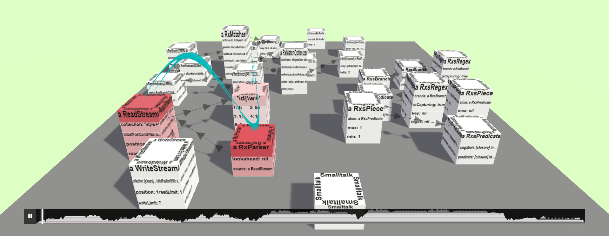

# trace4d

This project aims to improve program comprehension by visualizing traces of object-oriented programs through animated 2.5D object maps.
Program traces are created in [Squeak](https://squeak.org) using the [TraceDebugger](https://github.com/hpi-swa-lab/squeak-tracedebugger) and visualized in the browser using [three.js](https://threejs.org).

- **[Read the paper (preprint)](https://linqlover.github.io/trace4d/paper.pdf)** [](https://linqlover.github.io/trace4d/paper.pdf) [](https://linqlover.github.io/trace4d/paper.html)
- **[Try the demo](https://linqlover.github.io/trace4d/)**



[View more examples here.](./assets/examples.md)

## Repository Structure

- [`.github/workflows/`](./.github/workflows/): GitHub Actions workflows for CI
- [`assets/`](./assets/traces/):
  - [`assets/examples.md`](./assets/examples.md): Screenshots and screencasts of visualizing example program traces
  - [`assets/traces/`](./assets/traces/): Prepared serialized program traces of different Squeak programs (see [`docs/traces.md`](./docs/traces.md))
- [`docs/`](./docs/): Documentational artifacts
  - [`docs/paper/`](./docs/paper/): LaTeX sources of our paper preprint
  - [`docs/exposé/`](./docs/exposé/): LaTeX sources of our original exposé
  - [`docs/benchmarking.md`](./docs/benchmarking.md): Instructions for reproducing our benchmarking results
  - [`docs/experience-report.md`](./docs/experience-report.md): Instructions and results of our experience report
  - [`docs/traces.md`](./docs/traces.md): Descriptions of the provided [traces](./assets/traces/)
- [`packages/`](./packages/): Sources of the trace4d prototype
  - [`packages/BaselineOfTrace4D.package/`](./packages/BaselineOfTrace4D.package/): Metacello baseline for loading the trace4d backend in Squeak
  - [`packages/Trace4D.package/`](./packages/Trace4D.package/): Squeak backend (serialization of traces)
  - [`packages/frontend/`](./packages/frontend/): Browser visualization (three.js)

## Setup

### Backend (Squeak)

- Get [Squeak](https://squeak.org/downloads) (tested on Squeak 6.1Alpha #22599, but should technically work in Squeak 6.0)
- Load the trace4d backend:
  - via Metacello:
    ```smalltalk
    Metacello new
    	baseline: 'Trace4D';
    	repository: 'github://LinqLover/trace4d/packages';
    	load.
    ```
  - or manually:
    - Install the [TraceDebugger](https://github.com/hpi-swa-lab/squeak-tracedebugger)
    - Open the Git Browser (<kbd>Tools</kbd> in the world main docking bar)
	- Clone this repository and check out the `Trace4D` package

### Frontend (JavaScript)

See [packages/frontend/README.md](./packages/frontend/README.md).

## Usage

### Creating a Program Trace

For example, open a workspace and execute the following code (<kbd>Cmd</kbd> + <kbd>A</kbd>, <kbd>Cmd</kbd> + <kbd>D</kbd>):

```smalltalk
trace := T4DTrace forBlock:
	['\d|\w+' asRegex].
trace storeJsonInFileNamed: 'parseRegex.json'.
```

Find more inspiration in [docs/traces.md](./docs/traces.md) and in the class comment and examples of the `T4DTrace` class.

### Visualization

Open the visualization: [self-hosted](./packages/frontend/) or on [GitHub Pages](https://linqlover.github.io/trace4d/).

You can customize much of it through optional URL parameters:

- `trace`: path or URL to a [trace file](./assets/traces/) (e.g., `traces/regexParse.json` or `https://raw.githubusercontent.com/LinqLover/trace4d/main/assets/traces/regexParse.json`)
- `autoStart`: flag to automatically start the animation (default: not set)
- `countFPS`: flag to turn on FPS/MS/MB display (default: not set)
- `measureFPS`: flag to log FPS/MS/MB in `traceMap.stats.logs` (default: not set, requires `countFPS`)
- `measureStartTime`: flag to display the start-up time after loading (default: not set)
- obsolete:
  - `style`: `flatFDG` (default) or `hierarchical` (package/class organization, no longer fully supported)

Examples:

- [https://linqlover.github.io/trace4d/app.html](https://linqlover.github.io/trace4d/app.html)
- [https://linqlover.github.io/trace4d/app.html?trace=traces/regexMatch.json&countFPS](https://linqlover.github.io/trace4d/app.html?trace=traces/regexMatch.json&countFPS)
- http://localhost:5173/app.html?trace=https://raw.githubusercontent.com/LinqLover/trace4d/main/assets/traces/displayScanner.json?measureStartTime

If you have an [own trace file](#creating-a-program-trace), you can select it on the [landing page](https://linqlover.github.io/trace4d/).

#### Navigation

- **Navigate** through the scene using the mouse (drag to move, <kbd>Ctrl</kbd> + drag to rotate, scroll to zoom) or the keyboard (arrow keys to move, <kbd>Ctrl</kbd> + arrow keys to rotate).
- **Inspect** an object/field by clicking on it.
- **Override the layout** by moving objects around (<kbd>Shift</kbd> + drag) or unpin objects again (<kbd>Ctrl</kbd> + click).
- Press <kbd>Esc</kbd> to **stop the layout simulation** (recommended before starting the animation for performance reasons!).
- To **control the animation,** use the play/pause button in the timeline at the bottom, click on the timeline to jump to a specific point in time, or use the keyboard shortcuts (<kbd>Space</kbd> to play/pause, <kbd>Home</kbd> to reset the animation).
- To **explore the call tree** of the program trace, expand the flame graph by resizing the timeline and click/hover interesting frames.

#### Configuration

You can customize the visualization dynamically to change the visible objects and the layout.
To this end, open the Chrome DevTools (<kbd>F12</kbd>) and use the `traceMap` object in the console like this:

```js
// force layout:
traceMap.entityBuilder.forceWeights.references = 0.5
traceMap.entityBuilder.forceWeights.organization.sameClass = 0.1
traceMap.entityBuilder.forceWeights.globalFactor = 0.5
traceMap.entityBuilder.forceWeights.repulsion = 0.3
// object filtering:
traceMap.entityBuilder.excludedObjectNames.push("'an Object'")
traceMap.entityBuilder.excludedClassNames.push('ByteString')
traceMap.entityBuilder.excludeClasses = false
traceMap.reloadTrace()

traceMap.player.stepsPerSecond = 100
```

For the full protocol, please rely on the autocompletion or dig into the the [`FlatFDGEntityBuilder` implementation](./packages/frontend/src/map.js).

## Future Work and Issues

See [IDEAS.md](./IDEAS.md).
