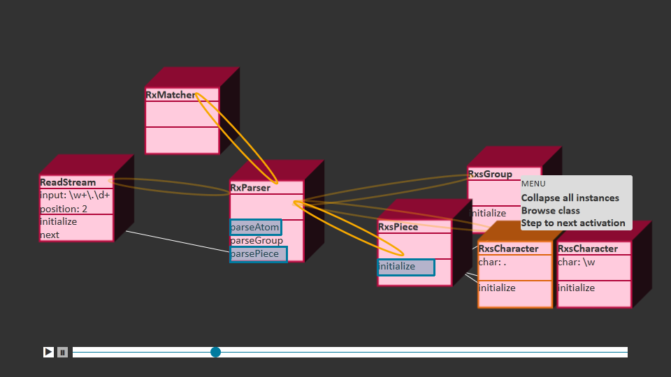

# Background

## Omniscient Debugging

*Omniscient debugging*, also referred to as *back-in-time debugging* or *time-travel debugging*, is a debugging technique that records the execution of a program and allows programmers to explore it independently of the original order of execution\ [@hofer2006design; @lewis2003debugging; @pothier2009back].
The resulting *program trace* consists of the program's behavior (typically represented through a *call tree*\ [@lienhard2008practical]) and, optionally, its historical states\ [@lienhard2008practical; @thiede2023object].
Programmers use omniscient debugging not only for fault localization but also for general *program exploration* as part of an *exploratory programming* process\ [@sandberg1988smalltalk; @rein2018exploration], e.g., to learn about the implementation of methods and the communication between objects in context, to refine their knowledge of an architecture, or to answer specific questions about the behavior of a system.

## Program Visualization

*Program visualization* is a broad field of approaches that use graphical representations of individual program execution instances to support the understanding of programs\ [@myers1986visual; @sorva2013review].
Program visualization employs various visual variables such as text, shapes, iconography, layouts, or color to display the state or the behavior of programs.
In particular, the term *algorithm animation* is mostly used in an educational context and focuses on interactive or moving visualizations of single algorithms\ [@hundhausen2002meta,@brown1984system; @levy2003jeliot; @velazquez2008srec; @seifert2022dbux].
Some program visualizations are entailed to specific domains or algorithms while others attempt to provide general-purpose mechanisms for visualizing arbitrary control flows or interactions\ [@reiss2006visualizing; @cheng2008xdiva; @chis2014moldable; @devkota2022domain].

For example, arbitrary program traces can be visualized by circular bundle views\ [@cornelissen2008execution], flame graphs\ [@trumper2012viewfusion], or treemaps of the call tree\ [@bockisch2015trace].
Some approaches can also visualize running programs instead of completed program traces\ [@greevy2006visualizing; @fittkau2013live].
Specifically for *object-oriented systems*, there are several approaches to visualizing program traces that take different perspectives such as the communication between objects\ [@cunningham1986; @schweizer2014] or modules\ [@prestin2022hidden], their data flow\ [@lienhard2009taking; @lienhard2009flow], or their state changes\ [@schulz2016visually; @thiede2023object].

## Software Maps

*Software maps* are 3D visualizations that represent the structure of software projects\ [@limberger2023visual].
Typical visual variables of software maps include the labels, shape and extent, color, and layout of entities.
The structure of software maps is usually derived from the static organization of a project into a package or file hierarchy, while the layout can be based on the dependencies or similarities\ [@atzberger2023visualization] between units.
In addition, they can display further attributes of the software units such as metrics about their architectural quality or evolution\ [@borgo2015natural,@atzberger2022visualization].
A common type of software map is a *2.5D treemap* that resembles planar 2D treemaps but is extended with a third dimension for the height of the cuboid entities that displays a metric such as the number of methods for each unit.
There are several other visual metaphors for representing treemaps, including landscapes\ [@atzberger2023visualization], tessellations\ [@balzer2005voronoi], and cities\ [@ardigo2021visualizing; @mortara2021visualization; @hoff2022utilizing; @limberger2023visual].

Software maps can also be enriched with *dynamic* information from program traces such as the activity in entities\ [@waller2013synchrovis; @krause2021live] or the amount of communication between them\ [@fittkau2013live; @ciolkowski2017visualization; @dashuber2022trace].
Some approaches also make the time of the underlying information accessible by animating software maps\ [@dugerdil2008execution; @langlier2008exploring] or providing means to navigate through them along the program execution\ [@fittkau2013live, sec. 8.4.5; @hori2019codehouse].

Other approaches use the city metaphor to visualize a software's memory heap instead of its architecture\ [@weninger2020memory].
Treemaps can also be combined with other types of visualizations such as graphs\ [@shengdong2005elastic].

## 3D Programming Environments

*3D programming environments* enable programmers to explore software systems in a 3D space that contains program artifacts such as classes or methods\ [@khaloo2017code; @merino2017cityvr; @geier2022toward].
These artifacts can be represented by normal code\ [@geier2022toward] or by visualizations such as software cities\ [@merino2017cityvr].
Programmers can interact with and navigate through the space using a conventional workstation\ [@khaloo2017code] or a VR headset\ [@merino2017cityvr; @geier2022toward].
The arrangement of the representations may be static or customizable by programmers, and programmers may be able to modify the code from the 3D environment\ [@geier2022toward].

# Research Question

Both program animation and software maps have proven to be useful visualizations for helping programmers explore programs.
However, due to the visual variables used and the lack of intuitive metaphors, existing program animations are usually limited to simple algorithms or processes with a small number of entities.
On the other hand, software maps mainly take a global and static perspective on software architectures which is not suitable for representing concrete processes or data.

To bridge this gap, in this seminar project of *Methods and Techniques for Visual Analytics*, we want to examine the following question:

> How can we improve the exploration of program traces through animated software cities that reveal the relevant entities from the program execution?

To answer this question, we want to build a novel prototype and use it to explore program traces from different scenarios.
Depending on the time available, we will also consider conducting a qualitative study ($N \leq 5$) to get feedback and experience reports from users.

# Approach

We want to develop a prototype that provides programmers with an interactive 3D visualization of the relevant entities from a recorded program trace (see +@fig:wireframe):

- *Entities* can represent individual object instances, classes, or higher-level organizational units such as packages.
  They can display the protocols and methods of classes and the internal state of objects.
- The visualization is *animated*: programmers can use play/pause buttons or a time slider to travel through the time, and entities display the current activity (e.g., activated methods or changed variables) through visual variables (e.g., a bright color).
- The visualization is *customizable*: programmers can control the layout and positioning of entities, filter the displayed entities and adjust their granularity/clustering (e.g., bundle objects into a single class entity or explode a class entity into individual objects).
- The visualization is *interactive*: programmers can select entities of interest to view their activation times in the time slider or to browse their implementation in an IDE.

{#fig:wireframe}

# Implementation

To retrieve the program traces, we will use the [TraceDebugger]{.smallcaps}^[<https://github.com/hpi-swa-lab/squeak-tracedebugger>], an omniscient debugger for the interactive programming system Squeak/Smalltalk^[<https://squeak.org/>] that provides an interface for tracing the behavior and state of a program.
It also provides several small to medium-sized examples of program traces from different domains such as UI systems, parsing, and exception handling.

To create the interactive visualizations, we will use a modern high-level visualization framework such as Three.js or D3.js or a game engine such as Godot or Babylon.js.

To connect the backend and the frontend, we will export the program trace in a format such as JSON.
Depending on the available time and focus, we may connect the backend and the frontend directly via WebSocket or long polling to enable programmers to navigate from their IDE to the visualization and back and to allow the visualization to dynamically retrieve additional data from the program trace.
The visualization can be displayed in a web browser window next to the Squeak IDE, but it would also be possible to embed it into Squeak using a web browser proxy such as [MagicMouse]{.smallcaps}^[<https://github.com/cmfcmf/MagicMouse>].

For building the prototype, we consider the following challenges and possible solution approaches:

Geometric layout.
:	To decide the position of entities, we want to use a force-directed graph.
	For computing the forces, we want to explore a combination of the static structure of the class organization and dynamic information such as the frequency of messages exchanged between objects and their mutual references.
	We also want to enable the user to override the initial layout by manually moving entities to relax the need for an optimal layout algorithm and to respect the specific domain knowledge of the user, which is a common practice in exploratory programming environments that support direct manipulation.

Linear time.
:	Because of method calls, recursion, and loops, call trees are deeply hierarchical and repetitive, but to play an animation, we need to condense the time into a linear view.
	Depending on the program trace, the condensed linear time may provide an inconsistent information density and prevent users from following the animated program execution smoothly.
	One way to address this issue would be to provide speed weights based on the depth of the call stack or user-provided inputs per unit.
	Users could also be provided with "step into"/"step over" buttons next to the time slider to skip redundant parts of the program trace.
	Ultimately, users could access the entire call tree for navigation, but this would increase the visual complexity and decrease usability.

Filtering/clustering interface.
:	We will try to implement the filtering and clustering mechanisms within the visualization following a direct manipulation style.
	For example, users could left-click on an entity to explode it, or right-click on a component to collapse it with all its siblings.
	However, if the required gesture set lacks intuitiveness or becomes too complex, we could switch to a conventional interface like a multi-select list widget instead.

# Next Steps

To bootstrap the prototype, we will design a serialization format for program traces from the TraceDebugger and implement a serializer in Squeak.
We will finalize the choice of the visualization framework and get some first hands-on experience with it by creating a minimal representation of cuboids for the program trace.
After that, we will explore further visual variables, add animation, and design means for filtering and clustering entities.
For example, visual variables could be mapped to dynamic software metrics, tails between entities could display the current call stack, or users could select some state of an object to highlight its changes in the time slider.

# References
